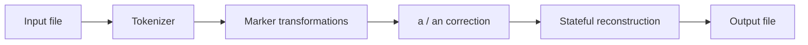

# Architecture: Token-Based Transformation Pipeline

`go-reloaded` separates text recognition from transformation and output formatting. The implementation uses three ordered passes over a token stream; quote state is needed only while reconstructing the final text.

## Data flow

## 1. Tokenization

`tokenize` scans Unicode runes and emits a slice containing:

- words and values;
- complete marker expressions such as `(cap, 2)`;
- grouped punctuation such as `...` and `!?`;
- individual single-quote tokens; and
- explicit newline tokens.

Discarding other whitespace at this stage gives reconstruction one place to enforce consistent spacing.

## 2. Marker transformations

The first processing pass builds a new token buffer. Recognized markers modify already-buffered tokens and are then consumed:

| Command | Transformation |
| --- | --- |
| `hex` | Parse the preceding token in base 16 and write its decimal value |
| `bin` | Parse the preceding token in base 2 and write its decimal value |
| `up` | Convert the target tokens to uppercase |
| `low` | Convert the target tokens to lowercase |
| `cap` | Lowercase each target token, then uppercase its first rune |

Case commands accept an optional count and work backwards from the marker. If the count exceeds the available buffer, every buffered token is transformed. Unknown parenthesized expressions remain in the token stream.

## 3. Grammar correction

The second pass performs the assignment's narrow grammar rule. A standalone `a` or `A` becomes `an` or `An` when the following token begins with a vowel or `h`, matched case-insensitively.

Keeping this rule after marker processing means it sees the content that will actually be emitted.

## 4. Stateful reconstruction

The last pass writes to a `strings.Builder` and decides whether a separator belongs before each token. It:

- attaches punctuation to the token on its left;
- removes spaces immediately inside paired single quotes;
- preserves explicit newlines; and
- inserts a single space between ordinary tokens.

An `inQuote` boolean distinguishes opening and closing quote tokens. This is the finite-state portion of the implementation; the overall processor is a pipeline rather than a single-pass FSM.

## Boundaries and testability

`main.go` owns argument validation and file I/O. `Process(string) string` owns deterministic text transformation, which keeps most tests fast and independent from the filesystem. CLI behavior is covered separately with temporary input and output files.
