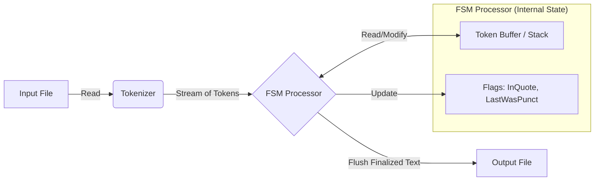

# Architecture: Token-Based Finite State Machine (FSM)

This document details the architectural design for the `go-reloaded` text processing tool.

## High-Level Concept
Instead of multiple passes (Regex replacement -> Punctuation fix -> Grammar fix), we use a **single-pass, token-based FSM**.
The system reads the input, breaks it into tokens, and processes them sequentially while maintaining a "sliding window" or buffer. This allows markers like `(hex)` or `(up, 2)` to look back and modify previously seen words before they are written to the final output.

## Data Flow Diagram



## Detailed State Logic

The "State Machine" here is driven by the **type** of the current token being processed.

### 1. The Tokenizer
Splits raw text into a slice of tokens.
*   **Input:** `Hello , world (up) !`
*   **Tokens:** `["Hello", " ", ",", " ", "world", " ", "(up)", " ", "!"]`
    *(Note: Whitespace handling can be simplified by ignoring explicit space tokens and managing spacing logic during output generation, but preserving newlines is important.)*

### 2. The Processor (The "Brain")
Iterates through the token list. It maintains a **Buffer** of processed words.

#### State Transitions & Rules

| Current Token Type | Action | State Change |
| :--- | :--- | :--- |
| **Word** | Append to `Buffer`. | `LastToken = Word` |
| **Marker (e.g., `(hex)`)** | Look at the last `1` (or `N`) words in `Buffer`.<br>Apply transformation (Base conversion).<br>Discard the marker token. | No change to `LastToken` logic (effectively invisible). |
| **Style Marker (e.g., `(up)`)** | Look at the last `1` (or `N`) words in `Buffer`.<br>Apply transformation (ToUpper, ToLower, Capitalize).<br>Discard the marker token. | No change. |
| **Punctuation (`. , ! ? : ;`)** | **Logic:**<br>1. Remove trailing space from the *previous* item in Buffer (attach left).<br>2. Add the punctuation.<br>3. Ensure a space follows (unless end of line). | `LastToken = Punctuation` |
| **Quote (`'`)** | **Logic:**<br>1. Check `InQuote` flag.<br>2. **If False (Opening):** Add space *before*, no space *after*.<br>3. **If True (Closing):** No space *before*, add space *after*.<br>4. Toggle Flag. | `InQuote = !InQuote` |
| **Article (`a` or `A`)** | **Logic:**<br>1. Look ahead to the *next* token.<br>2. If next starts with vowel/h, change `a` -> `an`.<br>3. Append to Buffer. | `LastToken = Word` |

### 3. Output Generation
After the loop finishes, join the `Buffer` into a single string (handling the spacing rules accumulated during processing) and write to the file.

## Edge Case Handling (Visualized)

### Example: Marker Look-Back
`Buffer: ["The", "number", "is", "1E"]`
**Next Token:** `(hex)`
1.  **Identify:** Token is `(hex)`.
2.  **Action:** Pop "1E" from Buffer. Convert to "30". Push "30".
3.  **Result Buffer:** `["The", "number", "is", "30"]`

### Example: Punctuation Group
`Buffer: ["I", "think"]`
**Next Token:** `.`
1.  **Identify:** Token is `.`.
2.  **Action:** Attach to "think" -> `["I", "think."]`
**Next Token:** `.`
1.  **Identify:** Token is `.` and previous was `.`.
2.  **Action:** Group logic -> Append directly. -> `["I", "think.."]`
**Next Token:** `.`
1.  **Action:** -> `["I", "think..."]`

## ASCII Fallback Diagram

```text
Input Stream:  "Word"  ->  "(up)"  ->  ","  ->  "Next"
                  |           |         |
                  v           v         v
[ BUFFER ]      [Word]      [WORD]    [WORD,]     Flushed to Output
                  ^           ^         ^
                  |           |         |
             (Normal)    (Transform) (Attach)
```
